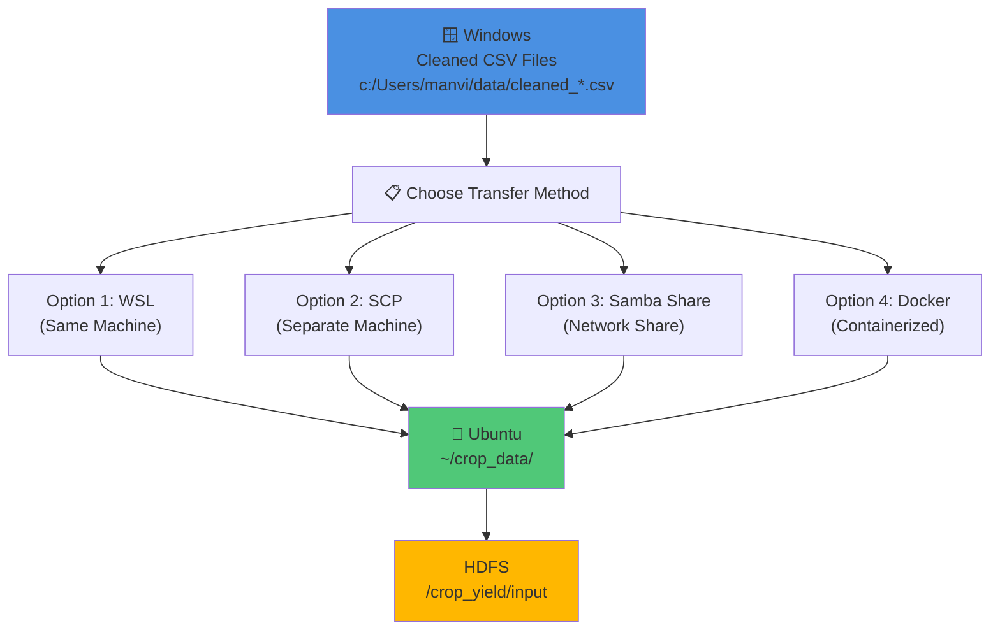

# Data Transfer Guide: Windows → Ubuntu

This guide explains how to copy your cleaned data files from Windows (where Python scripts run) to Ubuntu (where Hadoop/Hive/Spark runs).

---

## 📊 Data Transfer Architecture



---

## 📂 OPTION 1: WSL (Windows Subsystem for Linux) - EASIEST

If you have WSL Ubuntu installed on Windows:

### Step 1: Copy cleaned CSV files to WSL
```powershell
# In PowerShell as Administrator
$source = "C:\Users\manvi\crop_yeild_prediction\data\cleaned_*.csv"
$destination = "\\wsl$\Ubuntu\home\$env:USERNAME\crop_data"

# Create destination if not exists
New-Item -ItemType Directory -Force -Path $destination

# Copy files
Copy-Item -Path $source -Destination $destination -Recurse
```

### Step 2: Verify in Ubuntu
```bash
# In Ubuntu terminal (WSL)
ls -la ~/crop_data/
# Should show: cleaned_pesticides.csv, cleaned_rainfall.csv, etc.
```

### Step 3: Upload to HDFS
```bash
cd ~/crop_data
hdfs dfs -mkdir -p /crop_yield/input
hdfs dfs -put cleaned_*.csv /crop_yield/input/
hdfs dfs -ls /crop_yield/input/
```

---

## 🔄 OPTION 2: SCP (Secure Copy) - If Separate Machine

If you have Ubuntu on a separate machine or VM:

### Step 1: Find Ubuntu IP Address
```bash
# On Ubuntu
hostname -I
# Will show something like: 192.168.x.x
```

### Step 2: Copy from Windows PowerShell
```powershell
# On Windows PowerShell
$ubuntu_user = "your_username"           # Your Ubuntu username
$ubuntu_ip = "192.168.x.x"               # Ubuntu IP from Step 1
$windows_path = "C:\Users\manvi\crop_yeild_prediction\data\cleaned_*.csv"

# Copy files
scp -r $windows_path ${ubuntu_user}@${ubuntu_ip}:~/crop_data/

# When prompted, enter your Ubuntu password
```

### Step 3: Verify on Ubuntu
```bash
ls -la ~/crop_data/
```

### Step 4: Upload to HDFS
```bash
cd ~/crop_data
hdfs dfs -mkdir -p /crop_yield/input
hdfs dfs -put cleaned_*.csv /crop_yield/input/
```

---

## 📱 OPTION 3: Manual USB/Network Share

If automated transfer doesn't work:

### Step 1: Create Share on Ubuntu
```bash
# Install Samba (file sharing)
sudo apt-get install samba samba-common-bin -y

# Create shared directory
mkdir -p ~/shared_data
chmod 777 ~/shared_data

# Configure Samba
sudo nano /etc/samba/smb.conf

# Add at end:
[shared]
   path = /home/yourusername/shared_data
   browseable = yes
   writable = yes
   guest ok = yes
   public = yes

# Restart Samba
sudo systemctl restart smbd
```

### Step 2: Map Network Drive on Windows
```powershell
# In PowerShell
$ubuntu_ip = "192.168.x.x"
New-PSDrive -Name "UbuntuShare" -PSProvider FileSystem -Root "\\$ubuntu_ip\shared" -Persist

# Browse and copy files via File Explorer
# Z:\shared (or assigned drive letter)
```

### Step 3: Move to HDFS
```bash
cp ~/shared_data/cleaned_*.csv ~/crop_data/
cd ~/crop_data
hdfs dfs -put cleaned_*.csv /crop_yield/input/
```

---

## 🔗 OPTION 4: Docker Container (Advanced)

If you want everything in one container:

### Step 1: Use Docker Compose
```yaml
# docker-compose.yml
version: '3'
services:
  hadoop:
    image: sequenceiq/hadoop-docker:2.7.0
    ports:
      - "50070:50070"
      - "8088:8088"
    volumes:
      - ./data:/data
      - ./crop_yeild_prediction:/home/project

  hive:
    image: prestodb/presto:latest
    depends_on:
      - hadoop
    ports:
      - "8080:8080"
```

### Step 2: Run
```bash
docker-compose up -d
# Then copy data to ./data volume
```

---

## ⚡ QUICK SUMMARY - RECOMMENDED PATH

### If you have WSL:
```powershell
# Windows PowerShell
Copy-Item -Path "C:\Users\manvi\crop_yeild_prediction\data\cleaned_*.csv" `
          -Destination "\\wsl$\Ubuntu\home\$env:USERNAME\crop_data" -Recurse
```

```bash
# Ubuntu
cd ~/crop_data
hdfs dfs -mkdir -p /crop_yield/input
hdfs dfs -put cleaned_*.csv /crop_yield/input/
```

### If you have Separate Ubuntu:
```powershell
# Windows PowerShell
scp -r "C:\Users\manvi\crop_yeild_prediction\data\cleaned_*.csv" your_user@ubuntu_ip:~/crop_data/
```

```bash
# Ubuntu
cd ~/crop_data
hdfs dfs -mkdir -p /crop_yield/input
hdfs dfs -put cleaned_*.csv /crop_yield/input/
```

---

## ✅ VERIFY TRANSFER

After copying, verify on Ubuntu:
```bash
# Check local copy
ls -lh ~/crop_data/cleaned_*.csv

# Check HDFS copy
hdfs dfs -ls -h /crop_yield/input/cleaned_*.csv

# Count rows
hdfs dfs -cat /crop_yield/input/cleaned_yield.csv | wc -l
```

Expected output:
```
-rw-r--r-- 1 user group 2.3M May 5 10:00 cleaned_pesticides.csv
-rw-r--r-- 1 user group 1.8M May 5 10:00 cleaned_rainfall.csv
-rw-r--r-- 1 user group 3.2M May 5 10:00 cleaned_temp.csv
-rw-r--r-- 1 user group 0.5M May 5 10:00 cleaned_yield.csv
-rw-r--r-- 1 user group 1.1M May 5 10:00 cleaned_yield_df.csv
```

---

## 🚀 NEXT STEP

After successful verification, run:
```bash
cd ~/crop_yeild_prediction
./scripts/run_full_pipeline.sh
```

---
