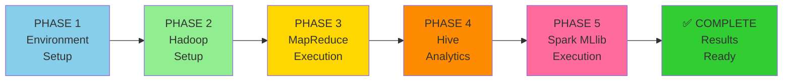

# COMPLETE EXECUTION GUIDE - Hadoop/Hive/Spark Pipeline
## For Crop Yield Prediction on Ubuntu

This guide provides step-by-step instructions to execute the complete big data pipeline on your Ubuntu Hadoop cluster.

---

## 📊 Pipeline Execution Phases



---

## 📋 QUICK START (5 minutes)

### On Ubuntu:
```bash
# Copy this from Windows first, then on Ubuntu:
cd ~/crop_yeild_prediction
chmod +x scripts/run_full_pipeline.sh
./scripts/run_full_pipeline.sh
```

### That's it! The script will:
1. ✅ Start Hadoop/YARN services
2. ✅ Create HDFS directories
3. ✅ Upload cleaned data
4. ✅ Compile & run MapReduce
5. ✅ Create Hive table
6. ✅ Execute Hive analytics
7. ✅ Run Spark MLlib models
8. ✅ Generate predictions

---

## 🔧 DETAILED STEP-BY-STEP EXECUTION

### PHASE 1: Environment Setup

#### Step 1.1: Set Up Spark Environment (Ubuntu)
```bash
# Edit ~/.bashrc and add:
export SPARK_HOME=/usr/local/spark
export HADOOP_CONF_DIR=$HADOOP_HOME/etc/hadoop
export YARN_CONF_DIR=$HADOOP_HOME/etc/hadoop
source ~/.bashrc

# Verify
spark-shell --version
```

#### Step 1.2: Verify All Services Available (Ubuntu)
```bash
# Check all required tools
hadoop version          # Should show Hadoop 3.x
hive --version         # Should show Hive 3.x
spark-submit --version # Should show Spark 3.x
jps                    # Check Java processes available
```

#### Step 1.3: Copy Data from Windows to Ubuntu

**Option A - Using WSL:**
```bash
# On Windows PowerShell
Set-Location C:\Users\manvi\crop_yeild_prediction
$wsl = wsl.exe -- bash -lc 'echo $HOME'
Copy-Item -Path data/cleaned_*.csv -Destination "\\wsl$\Ubuntu\home\$env:USERNAME\crop_data\" -Recurse
```

**Option B - Using SCP (if separate machine):**
```bash
# On Windows PowerShell
$ubuntu_user = "your_username"
$ubuntu_ip = "192.168.x.x"
scp -r C:\Users\manvi\crop_yeild_prediction\data\cleaned_*.csv ${ubuntu_user}@${ubuntu_ip}:~/crop_data/
```

**Option C - Manual Copy:**
```bash
# On Ubuntu
mkdir -p ~/crop_data
# Manually copy CSV files to this directory
```

---

### PHASE 2: Hadoop Setup

#### Step 2.1: Start Hadoop Services (Ubuntu)
```bash
cd $HADOOP_HOME/sbin
./start-dfs.sh
./start-yarn.sh
sleep 3
jps

# Expected output:
# NNNN NameNode
# NNNN DataNode  
# NNNN ResourceManager
# NNNN NodeManager
# NNNN Jps
```

#### Step 2.2: Create HDFS Directories (Ubuntu)
```bash
hdfs dfs -mkdir -p /crop_yield/input
hdfs dfs -mkdir -p /crop_yield/cleaned
hdfs dfs -mkdir -p /crop_yield/models
hdfs dfs -mkdir -p /crop_yield/predictions
hdfs dfs -mkdir -p /crop_yield/results

# Verify
hdfs dfs -ls /crop_yield/
```

#### Step 2.3: Upload Cleaned Data (Ubuntu)
```bash
cd ~/crop_data
hdfs dfs -put cleaned_*.csv /crop_yield/input/

# Verify upload
hdfs dfs -ls -h /crop_yield/input/
hdfs dfs -cat /crop_yield/input/cleaned_yield.csv | head -5
```

---

### PHASE 3: MapReduce Execution

#### Step 3.1: Compile MapReduce Job (Ubuntu)
```bash
cd ~/crop_yeild_prediction/src

# Set classpath
export CLASSPATH=$HADOOP_HOME/etc/hadoop/:$HADOOP_HOME/share/hadoop/common/*:$HADOOP_HOME/share/hadoop/hdfs/*:$HADOOP_HOME/share/hadoop/yarn/*:$HADOOP_HOME/share/hadoop/mapreduce/*

# Compile
javac -cp $CLASSPATH DataCleaning.java

# Verify class created
ls -la DataCleaning.class

# Create JAR
cd ~/crop_yeild_prediction
jar cf DataCleaning.jar src/DataCleaning.class
ls -la DataCleaning.jar
```

#### Step 3.2: Run MapReduce Job (Ubuntu)
```bash
cd ~/crop_yeild_prediction

# Run with 2 reducers
hadoop jar DataCleaning.jar DataCleaning /crop_yield/input /crop_yield/cleaned 2

# Monitor in browser
# Open: http://localhost:8088 (YARN ResourceManager)
# Open: http://localhost:50070 (HDFS NameNode)

# Wait for completion (watch the terminal for completion message)
# Then verify output
hdfs dfs -ls /crop_yield/cleaned/
hdfs dfs -cat /crop_yield/cleaned/part-r-00000 | head -10
```

---

### PHASE 4: Hive Analytics

#### Step 4.1: Start Hive CLI (Ubuntu)
```bash
hive

# You'll see:
# hive>
```

#### Step 4.2: Create External Table (In Hive CLI)
```sql
-- In Hive CLI, execute:
CREATE EXTERNAL TABLE IF NOT EXISTS cleaned_yield (
    country STRING,
    year INT,
    temperature DOUBLE,
    rainfall DOUBLE,
    pesticides DOUBLE,
    yield DOUBLE
)
ROW FORMAT DELIMITED FIELDS TERMINATED BY ','
SKIP.HEADER.LINE.COUNT=1
STORED AS TEXTFILE
LOCATION '/crop_yield/cleaned';

-- Verify table created
SHOW TABLES;

-- Check row count
SELECT COUNT(*) FROM cleaned_yield;

-- Preview data
SELECT * FROM cleaned_yield LIMIT 5;
```

#### Step 4.3: Run Hive Queries (Ubuntu)
```bash
# Exit Hive CLI first (type 'exit;')
exit;

# Run all queries from file
cd ~/crop_yeild_prediction
hive -f scripts/crop_trends.hql > hive_output.txt 2>&1

# View results
cat hive_output.txt

# Or run interactively:
hive < scripts/crop_trends.hql
```

#### Step 4.4: Export Results (Ubuntu)
```bash
# Create output directory
hdfs dfs -mkdir -p /crop_yield/results

# Export top 100 rows to HDFS
hive -e "
    INSERT OVERWRITE DIRECTORY '/crop_yield/results'
    ROW FORMAT DELIMITED FIELDS TERMINATED BY ','
    SELECT * FROM cleaned_yield LIMIT 100;
"

# Verify results
hdfs dfs -ls /crop_yield/results/
hdfs dfs -cat /crop_yield/results/000000_0 | head -20
```

---

### PHASE 5: Spark MLlib Execution

#### Step 5.1: Run Spark MLlib Pipeline (Ubuntu)
```bash
cd ~/crop_yeild_prediction

# Submit Spark job
spark-submit \
    --master yarn \
    --deploy-mode client \
    --num-executors 2 \
    --executor-cores 2 \
    --executor-memory 2g \
    --driver-memory 1g \
    scripts/spark_yield_prediction.py

# Monitor in YARN UI: http://localhost:8088
```

#### Step 5.2: Check Results (Ubuntu)
```bash
# View predictions
hdfs dfs -ls /crop_yield/predictions/
hdfs dfs -cat /crop_yield/predictions/part-* | head -20

# View trained models
hdfs dfs -ls /crop_yield/models/

# Download results
hdfs dfs -get /crop_yield/predictions ~/predictions_output/
hdfs dfs -get /crop_yield/models ~/models_output/
ls -la ~/predictions_output/
ls -la ~/models_output/
```

---

## 📊 MONITORING & VERIFICATION

### Real-time Monitoring
```bash
# YARN status
yarn application -list
yarn application -status application_XXXXXXXX_XXXX

# HDFS status
hdfs dfsadmin -report
hdfs dfs -du -sh /crop_yield/*

# View logs
yarn logs -applicationId application_XXXXXXXX_XXXX
spark-submit ... --verbose
```

### Verify Each Phase
```bash
# Phase 1: Data uploaded
echo "Data in HDFS:"
hdfs dfs -ls /crop_yield/input/

# Phase 2: MapReduce completed
echo "Cleaned data:"
hdfs dfs -ls /crop_yield/cleaned/

# Phase 3: Hive table
hive -e "SELECT COUNT(*) FROM cleaned_yield;"

# Phase 4: Hive results
echo "Query results:"
hdfs dfs -ls /crop_yield/results/

# Phase 5: Spark models
echo "Trained models:"
hdfs dfs -ls /crop_yield/models/

# Phase 5: Predictions
echo "Predictions:"
hdfs dfs -ls /crop_yield/predictions/
```

---

## 📥 DOWNLOAD RESULTS TO WINDOWS

### From Ubuntu to Windows (WSL):
```bash
# On Ubuntu
cp ~/predictions_output/* /mnt/c/Users/manvi/crop_yeild_prediction/data/spark_predictions/
cp ~/models_output/* /mnt/c/Users/manvi/crop_yeild_prediction/models/spark_models/
```

### From Ubuntu to Windows (SCP):
```powershell
# On Windows PowerShell
$ubuntu_user = "your_username"
$ubuntu_ip = "192.168.x.x"
scp -r ${ubuntu_user}@${ubuntu_ip}:~/predictions_output/* C:\Users\manvi\crop_yeild_prediction\data\spark_predictions\
scp -r ${ubuntu_user}@${ubuntu_ip}:~/models_output/* C:\Users\manvi\crop_yeild_prediction\models\spark_models\
```

---

## ✅ FINAL VERIFICATION

Once complete, verify all outputs:

```bash
# On Ubuntu
echo "=== DATA PIPELINE COMPLETE ===" 
echo "1. HDFS Data:"
hdfs dfs -du -sh /crop_yield/
echo ""
echo "2. Hive Table Rows:"
hive -e "SELECT COUNT(*) FROM cleaned_yield;"
echo ""
echo "3. Spark Predictions:"
hdfs dfs -cat /crop_yield/predictions/part-* | wc -l
echo ""
echo "4. Model Location:"
hdfs dfs -ls /crop_yield/models/
echo ""
```

Expected status: ✅ All directories populated with data

---

## 🚨 TROUBLESHOOTING

### Issue: HDFS Connection Failed
```bash
# Check NameNode status
hdfs dfsadmin -report | head -20
# Restart if needed
$HADOOP_HOME/sbin/stop-dfs.sh && sleep 2 && $HADOOP_HOME/sbin/start-dfs.sh
```

### Issue: MapReduce Job Hangs
```bash
# Kill and restart
yarn application -kill application_XXXXXXXX_XXXX
# Check logs
yarn logs -applicationId application_XXXXXXXX_XXXX | tail -50
```

### Issue: Spark Job Out of Memory
```bash
# Increase memory and re-run
spark-submit \
    --driver-memory 2g \
    --executor-memory 4g \
    scripts/spark_yield_prediction.py
```

### Issue: Hive Table Empty
```bash
# Repair table
hive -e "MSCK REPAIR TABLE cleaned_yield;"
# Verify again
hive -e "SELECT COUNT(*) FROM cleaned_yield;"
```

---

## 📈 NEXT STEPS

After successful execution:

1. **Analyze Results**: Review predictions in `/crop_yield/predictions/`
2. **Validate Models**: Check model accuracy metrics
3. **Schedule Pipeline**: Set up cron job for regular execution
4. **Integrate Dashboard**: Connect results to visualization tools
5. **Scale Up**: Adjust executor counts for larger datasets

---

## 📞 SUPPORT

For issues or questions:
1. Check the relevant troubleshooting section above
2. Review log files in HDFS
3. Verify environment variables are set correctly
4. Ensure all services (Hadoop, Hive, Spark) are running

