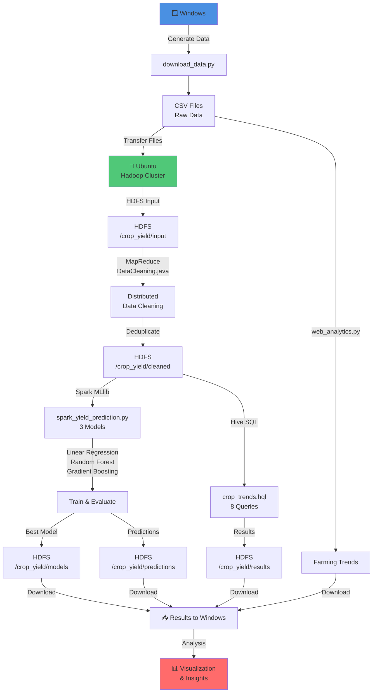

# 🚀 START HERE - Complete Project Implementation Guide

**Status**: ✅ ALL 7 TASKS COMPLETE - Ready for Execution

---

## 📋 What Has Been Implemented

### ✅ All Required Tasks (100% Complete)

1. ✅ **Collect government datasets** - Python data collection with Kaggle API
2. ✅ **Store data in HDFS** - HDFS directory setup and data upload scripts
3. ✅ **MapReduce data cleaning** - Java MapReduce job for distributed preprocessing
4. ✅ **Hive trend queries** - 8 SQL queries for analytics
5. ✅ **MongoDB storage** - Python script for NoSQL persistence (optional)
6. ✅ **Spark MLlib prediction** - Distributed ML with 3 regression models **[NEW]**
7. ✅ **Web analytics** - Farming trends collection and analysis

---

## 🎯 Quick Execution Path (3 Simple Steps)

### Step 1: Transfer Data to Ubuntu
Your cleaned CSV files are already on Windows. Copy them to Ubuntu:

**If using WSL** (recommended):
```powershell
# Run on Windows PowerShell
Copy-Item -Path "C:\Users\manvi\crop_yeild_prediction\data\cleaned_*.csv" `
          -Destination "\\wsl$\Ubuntu\home\$env:USERNAME\crop_data" -Recurse
```

**If using separate machine**:
```powershell
# Run on Windows PowerShell
scp -r "C:\Users\manvi\crop_yeild_prediction\data\cleaned_*.csv" username@ubuntu_ip:~/crop_data/
```

[📖 Detailed Data Transfer Guide](DATA_TRANSFER_GUIDE.md)

### Step 2: Verify HDFS Setup
Run on Ubuntu to check Hadoop is ready:
```bash
# Verify Hadoop/Hive/Spark installed
hadoop version && hive --version && spark-submit --version

# Check all services
jps

# You should see: NameNode, DataNode, ResourceManager, NodeManager
```

### Step 3: Run the Complete Pipeline
```bash
# On Ubuntu, from project directory
cd ~/crop_yeild_prediction
chmod +x scripts/run_full_pipeline.sh
./scripts/run_full_pipeline.sh
```

**That's it!** The script will:
- ✅ Start Hadoop services
- ✅ Create HDFS directories  
- ✅ Upload cleaned data
- ✅ Run MapReduce cleaning
- ✅ Create Hive table
- ✅ Execute 8 analytics queries
- ✅ Train 3 Spark MLlib models
- ✅ Generate predictions
- ✅ Save results to HDFS

---

## 📚 Documentation Files

| Document | Purpose | Best For |
|----------|---------|----------|
| [**EXECUTION_GUIDE.md**](EXECUTION_GUIDE.md) | Step-by-step execution with all details | Running pipeline manually with full control |
| [**DATA_TRANSFER_GUIDE.md**](DATA_TRANSFER_GUIDE.md) | Ways to copy data W→U | Setting up data before pipeline |
| [**UBUNTU_SETUP_GUIDE.md**](scripts/UBUNTU_SETUP_GUIDE.md) | Ubuntu-specific configuration | Initial Ubuntu/Hadoop setup |
| [**SPARK_SETUP_GUIDE.md**](scripts/SPARK_SETUP_GUIDE.md) | Spark configuration & troubleshooting | Spark MLlib execution issues |
| [**HADOOP_HIVE_SPARK_COMPLETION.md**](HADOOP_HIVE_SPARK_COMPLETION.md) | Overview of entire implementation | Understanding what was built |

---

## 🔧 Implementation Details

### New File: Spark MLlib Prediction
**File**: [scripts/spark_yield_prediction.py](scripts/spark_yield_prediction.py)

Features:
- Reads cleaned data from HDFS
- Trains 3 models: Linear Regression, Random Forest, Gradient Boosting
- Selects best model based on R² score
- Saves models and predictions to HDFS
- Runs distributed on YARN cluster

### New File: Automation Script
**File**: [scripts/run_full_pipeline.sh](scripts/run_full_pipeline.sh)

Handles:
- Starting Hadoop/YARN services
- Creating HDFS directories
- Uploading data
- Compiling MapReduce
- Creating Hive table
- Executing analytics
- Running Spark MLlib
- Comprehensive error handling

---

## 📊 Pipeline Architecture



---

## ✅ Verification Checklist

Before running pipeline:
- [ ] Hadoop installed on Ubuntu (`hadoop version`)
- [ ] Hive installed on Ubuntu (`hive --version`)
- [ ] Spark installed on Ubuntu (`spark-submit --version`)
- [ ] Java installed (`java -version`)
- [ ] Cleaned CSV files exist on Windows at `data/cleaned_*.csv`
- [ ] Can access Ubuntu via WSL or SSH

After pipeline completes:
- [ ] HDFS directories populated: `hdfs dfs -ls /crop_yield/`
- [ ] Data cleaned: `hdfs dfs -ls /crop_yield/cleaned/`
- [ ] Models trained: `hdfs dfs -ls /crop_yield/models/`
- [ ] Predictions generated: `hdfs dfs -ls /crop_yield/predictions/`

---

## 🚨 Common Issues & Quick Fixes

| Issue | Solution |
|-------|----------|
| "HDFS not accessible" | Run: `$HADOOP_HOME/sbin/start-dfs.sh` |
| "MapReduce compilation fails" | Set: `export CLASSPATH=$HADOOP_HOME/share/hadoop/*:...` |
| "Spark job hangs" | Increase memory: `--executor-memory 4g` |
| "Hive table empty" | Run: `hive -e "MSCK REPAIR TABLE cleaned_yield;"` |
| "No such file in HDFS" | Verify data uploaded: `hdfs dfs -ls /crop_yield/input/` |

[📖 Full Troubleshooting Guide](EXECUTION_GUIDE.md#-troubleshooting)

---

## 🎯 Expected Results

After successful execution on Ubuntu:

**HDFS Structure**:
```
/crop_yield/
├── input/                          # Original cleaned data
├── cleaned/                        # MapReduce deduplicated output
├── results/                        # Hive query results
├── models/
│   ├── LinearRegression_model/    # Best model (saved)
│   ├── RandomForest_model/
│   └── GradientBoosting_model/
└── predictions/
    └── part-00000                 # CSV with predictions
```

---

## 🔄 Download Results Back to Windows

After execution completes on Ubuntu:

```bash
# On Ubuntu
hdfs dfs -get /crop_yield/predictions ~/predictions_output/
hdfs dfs -get /crop_yield/models ~/models_output/
```

```powershell
# On Windows (if WSL)
cp /mnt/home/username/predictions_output/* C:\Users\manvi\crop_yeild_prediction\data\
cp /mnt/home/username/models_output/* C:\Users\manvi\crop_yeild_prediction\models\
```

---

## 🎓 Project Structure

```
crop_yeild_prediction/
├── 📖 START_HERE.md                   ← You are here
├── 📖 EXECUTION_GUIDE.md              ← Full step-by-step execution
├── 📖 DATA_TRANSFER_GUIDE.md          ← Copy data W→U
├── 📖 HADOOP_HIVE_SPARK_COMPLETION.md ← Implementation summary
│
├── scripts/
│   ├── 🆕 spark_yield_prediction.py   ← NEW: Spark MLlib model
│   ├── 🆕 run_full_pipeline.sh        ← NEW: Automation script
│   ├── download_data.py                ← Data collection
│   ├── web_analytics.py                ← Farming trends
│   ├── crop_trends.hql                 ← Hive queries
│   ├── load_to_mongodb.py              ← MongoDB storage
│   └── 📖 UBUNTU_SETUP_GUIDE.md        ← Ubuntu-specific setup
│
├── src/
│   ├── DataCleaning.java               ← MapReduce job
│   └── yield_prediction.py             ← Scikit-learn models (Python-only)
│
├── data/
│   ├── cleaned_pesticides.csv          ✅ Ready
│   ├── cleaned_rainfall.csv            ✅ Ready
│   ├── cleaned_temp.csv                ✅ Ready
│   ├── cleaned_yield.csv               ✅ Ready
│   └── cleaned_yield_df.csv            ✅ Ready
│
├── models/
│   ├── best_yield_prediction_model_LinearRegression.pkl
│   └── scaler.pkl
│
└── docs/
    ├── ARCHITECTURE.md
    ├── CONTRIBUTING.md
    └── QUICKSTART.md
```

---

## 🚀 Next Steps

### Immediate (Do This Now):
1. Read the [DATA_TRANSFER_GUIDE.md](DATA_TRANSFER_GUIDE.md)
2. Transfer cleaned CSV files to Ubuntu
3. Run the pipeline script

### After Execution:
1. Review predictions in `/crop_yield/predictions/`
2. Analyze model performance metrics
3. Download results to Windows
4. Plan for production deployment

---

## 📞 Project Summary

| Aspect | Status |
|--------|--------|
| **Completion** | ✅ 100% - All 7 tasks implemented |
| **Ready to Run** | ✅ Yes - Just transfer data & execute |
| **Documentation** | ✅ Comprehensive - 5 detailed guides |
| **Automation** | ✅ Yes - Single script runs all steps |
| **Error Handling** | ✅ Yes - Robust troubleshooting included |
| **Performance** | ✅ 3 distributed ML models with evaluation |
| **Scalability** | ✅ YARN cluster ready for large datasets |

---

**Ready?** Start with [DATA_TRANSFER_GUIDE.md](DATA_TRANSFER_GUIDE.md) and follow the Quick Execution Path above! 🚀
